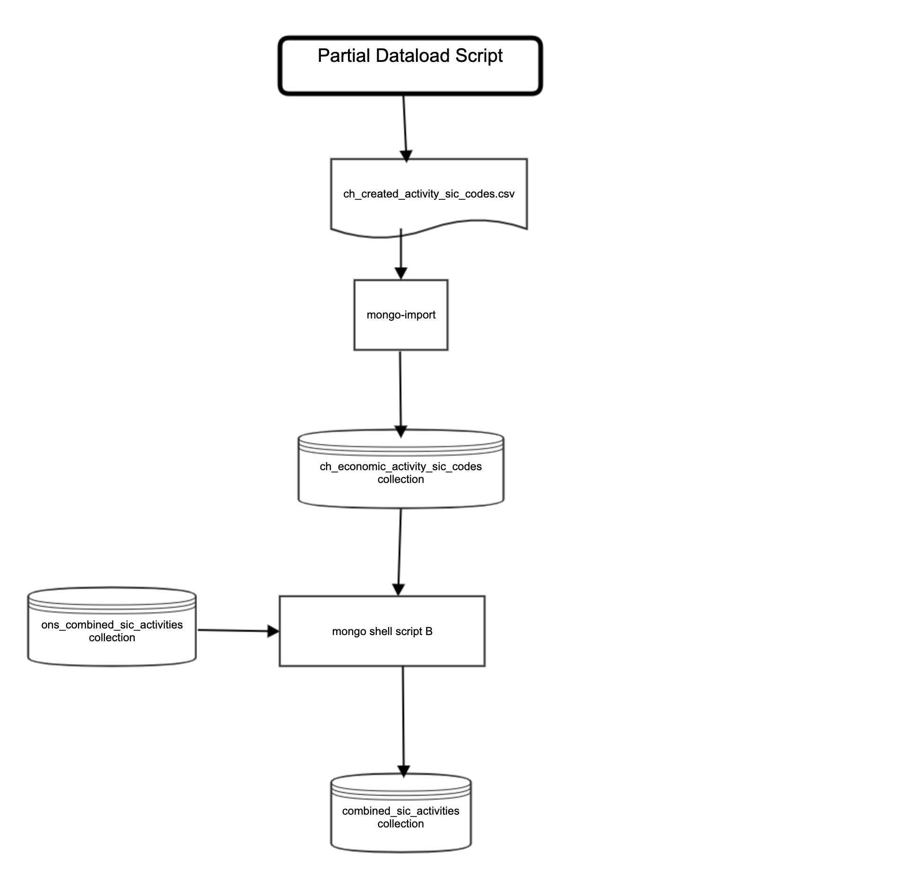

# Partial refresh of the SIC Code Mongo database

## Summary

This script is run when just the CH economic activities need updating.

The following collection will be sourced from `csv` files (in the `src/source_datafiles` directory):

- `ch_economic_activity_sic_codes` from src/source_datafiles/ch_created_activity_sic_codes.csv.

The collection, `combined_sic_activities`, is created by merging by merging the `ons_combined_sic_activities` and the `ch_economic_activity_sic_codes` collections via a mongo script (it also removes any bracket characters that caused misses in the search match). This collection is used for the full-text Mongo search as describe in the `sic-code-api` docs. This collection will then be imported in each test environment via a manually triggered concourse job. For staging and live this will be deployed via a CHS release note.

## Diagram



## Import the updated `CH economic actitivity` import file and transform

First set the following [environmental variables](environmental-variables.md).

``` bash
src/scripts/partial_refresh_sic_code_database.sh
# Check the sic_code database
src/scripts/partial_export_mongo_collections.sh
```

## Configuration Manage the Mongo Collection export files

The changed files are in `src/import_files`  need to be updated in this projects GitHub repository.
