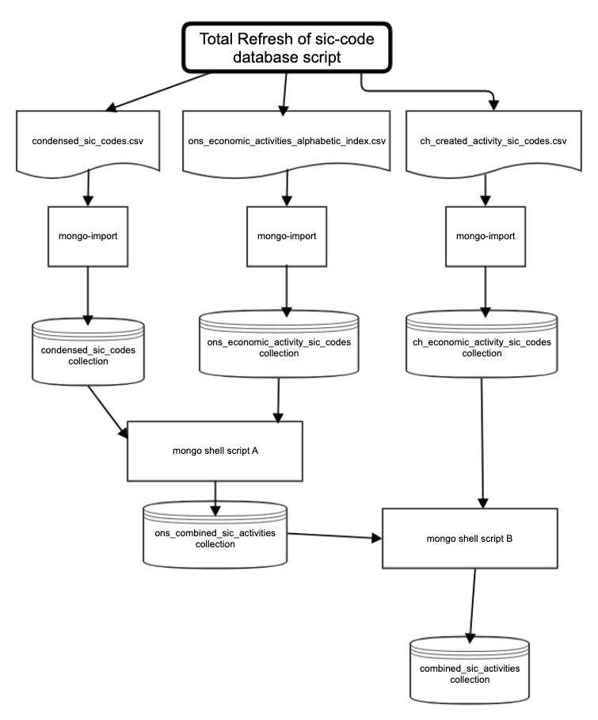

# The total refresh of the SIC Code Mongo database

## Summary

For the initial release a set of Mongo DB import files will be created for each Mongo Collection and stored in the GitHub repository.

The following collections will be sourced from `csv` files (in the `src/source_datafiles` directory):

The collection, `combined_sic_activities`, has been created by merging the above collections via a mongo script (it also removes any bracket characters that caused misses in the search match). This collection is used for the full-text Mongo search as describe in the `sic-code-api` docs. This collection will then be imported in each target environment via a manually triggered concourse job.

## Diagram



## Import the standard `sic-code` import files

Run

First set the following [environmental variables](environmental-variables.md).

``` bash
src/scripts/total_refresh_sic_code_database.sh
```
